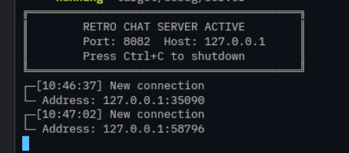
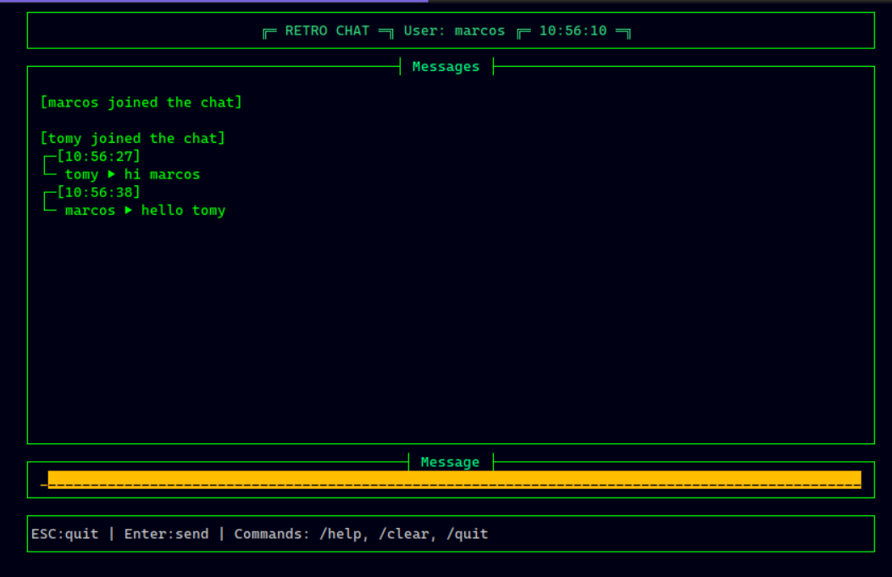
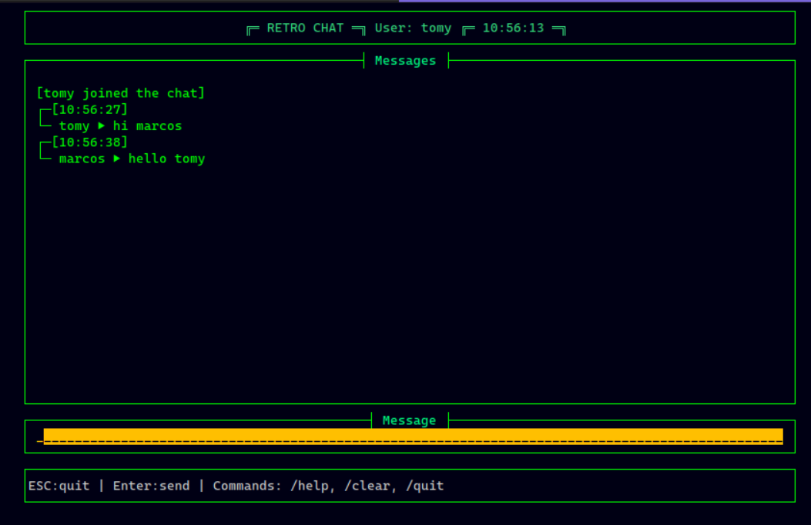

# Rust CLI Chat

## 📖 About
This is a simple command-line chat application built with Rust. It uses a client-server architecture to allow multiple users to chat in a shared room. The client provides a terminal-based user interface using the `cursive` library, while the server handles message broadcasting and user management.

## ✨ Features
- Real-time messaging
- Terminal-based UI
- Simple and easy to use

## 🚀 How to Run
To run this project, you will need to have Rust and Cargo installed on your system.

### Clone the repository
```bash
git clone https://github.com/your-username/rust-cli-chat.git
cd rust-cli-chat
```

### Run the server
```bash
make run-server
```
or
```bash
cargo run --bin server
```

### Run the client
In a new terminal window, run the following command:
```bash
make run-client username=your-username
```
or
```bash
cargo run --bin client your-username
```

## 📸 Screenshots
### Server


### Client

